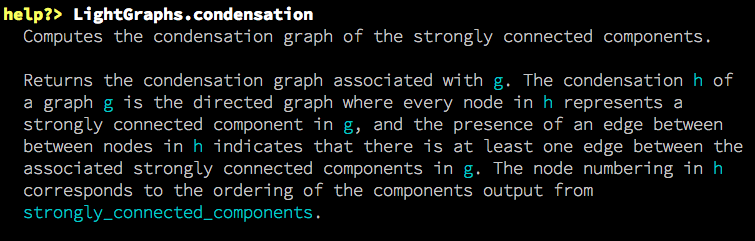
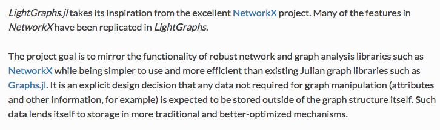

# Documenting Julia

---

## Docstrings

Shiny in 0.4.

Among the *many* features is the up and coming (recently released??) julia is
docstrings.

---

## In this talk

- how to write docstrings.
- use docstrings to generate documentation.
- how to host documentation.

---

## Syntax

```rb
"""Markdown goes *here*."""
function foo() end

doc"""Markdown goes *here*, also $\LaTeX$"""
function bar() end
```

---

## Tips

- You can use single quotes but triple quotes should be preferred.
- You should only use h4+ (for reasons discussed later).

---

## That's it!

Just works<sup>TM</sup>.

---

### Backwards compat (0.3)

As a user you can still have docstrings, but you need to use `Lexicon.jl`.

As a package writer there's no need to require Lexicon, just use Compat
(if you want to use the doc"""...""" syntax; latex).

(TODO Compat.jl PR).

---

So now you have docstrings...

## So what?

---

HELP works:



Renders in markdown, or if using Juno etc. rendered as html.

TODO: include juno image.

---

#### REPL EXAMPLE

In 0.3 you have to use Lexicon (lazily) looks up documentation.

```
help> foo # nope.
julia> using Lexicon
help> foo # yup
```

*Note: help worked in 0.3 Base (but did not extend to user/library-defined methods).*

---

## Online documentation

What you want: documentation to be generated from docstrings.

- don't repeat yourself (document functions in just one place)
- don't let documentation go out of sync

=> We should generate it from the docstrings.

---

TODO: include condensation image (from lightgraphs) when layout is finalized.

---

## How to generate

---

#### docs/build.jl
```
using YourPackage
using Lexicon

generate_for(YourPackage, "about.md", "linalg.md")
```

TODO: finalize api

---

#### docs/about.md

```
{{YourPackage}}

{{
    foo
    bar
}}

{{repl
    > using YourPackage
    > foo()
}}
```

these are expanded to markdown in `docs/_generated/about.md`.

---

So:

```
{{LightGraphs}}
```

becomes the same as help YourPackage.



TODO images from help of functions.

---

```
{{repl
    > foo()
    > bar()
}}
```
is expanded to

```
julia> foo()
23
julia> bar()
42
```

---

## Recap

So now you can rewrite your documentation to make use of

1. executed code
2. pretty/consistent docstrings

---

## Hosting online documentation

You can use mkdocs and readthedocs (many projects already do this). Very
easy to set up:

1. sign in [readthedocs.org](https://readthedocs.org/)
2. change [documentation type](https://docs.readthedocs.org/en/latest/builds.html) to mkdocs
3. include an `mkdocs.yml`\*

\*Hint: copy someone elses! (Lexicon may be able to build it in the future.)

---

## mkdoc.yml

```
TODO include sample (with docs/_generated)
```

---

# What can you do

---


---

1. Convert docstrings to the new syntax.
2. Migrate current documentation to {{}} Lexicon syntax.
3. ??
4. Profit.

---

# Fin.

Special thanks:

- Michael Hatherly for Lexicon and helping get this all working!
- Mike Innes for Markdown, Juno, and much of the docstring work.

