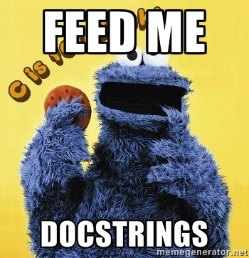
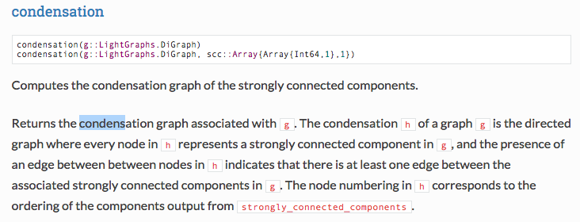

# Documenting Julia

---

## Docstrings

Shiny in 0.4.

Among the *many* features is recently released latest julia is
docstrings.

---

## In this talk

- how to write docstrings.
- use docstrings to generate documentation.
- how to host documentation.

---

## Syntax

```rb
"""Markdown goes *here*."""
function foo() end

doc"""Markdown goes *here*, also $\LaTeX$"""
function bar() end
```

---

## Tips

- You can use single quotes but triple quotes should be preferred.
- You should only use h4+ (for reasons discussed later).

---

## That's it!

Just works<sup>TM</sup>.

---

### Backwards compat (0.3)

As a user you can still have docstrings, but you need to use `Lexicon.jl`.

As a package writer there's no need to require Docile/Lexicon
(unless you want to use the doc"""...""" syntax e.g. for latex).

---

So now you have docstrings...

## So what?

---

HELP works:


Renders in markdown, or if using Juno or Jupyter etc. rendered as html.

---

#### REPL EXAMPLE

In 0.3 you have to use Lexicon (lazily) looks up documentation.

```
help> foo # nope.
julia> using Lexicon
help> foo # yup
```

*Note: help worked in 0.3 Base (but did not extend to user/library-defined methods).*

---

## Online documentation

What you want:

- don't repeat yourself (document functions in just one place).
- don't let documentation go out of sync.
- minimize noise.

=> We should generate it from the docstrings.

---



---

See http://lightgraphsjl.readthedocs.org/en/latest/pathing/.



(This layout is WIP.)

Note: Reason not to include > h4.

---

## How to generate

---

#### docs/build.jl
```
using YourPackage
using Docile      # NOTE: Currently only rewrite branch

makdocs()
```

*TODO: finalize api!*

---

#### docs/src/about.md

```
@{YourPackage}

@{
    foo
    bar
}

@repl{
    > using YourPackage
    > foo()
}
```

these are expanded to markdown in `docs/build/about.md`.

---

So:

```
{{LightGraphs}}
```

becomes the same as help YourPackage.


---

```
@repl{
    > foo()
    > bar()
}
```
is expanded to

```
julia> foo()
23
julia> bar()
42
```

---

### Also

- Generate a top-level `README.md` by putting a similar file as `doc/src/README.md`.
- Document arguments, references with Docile.Hooks/
- Cross-references.

---

## Recap

So now you can rewrite your documentation to make use of

1. executed code
2. pretty/consistent docstrings

---

## Hosting online documentation

You can use mkdocs and readthedocs (many projects already do this). Very
easy to set up:

1. sign in [readthedocs.org](https://readthedocs.org/)
2. change [documentation type](https://docs.readthedocs.org/en/latest/builds.html) to mkdocs
3. include an `mkdocs.yml`\*

\*Hint: copy someone elses!

*Note: Docile may be able to build it in the future.*

---

## mkdoc.yml

```
site_name: LightGraphs.jl
site_author: Seth Bromberger
repo_url: https://github.com/JuliaGraphs/LightGraphs.jl/
theme: readthedocs
pages:
  - 'Home': 'index.md'
  - 'About': 'about.md'
  - 'Getting Started': 'gettingstarted.md'
  - 'Operators': 'operators.md'
  - 'Path and Traversal': 'pathing.md'
  - 'Distance': 'distance.md'
  - 'Centrality measures': 'centrality.md'
  - 'Linear Algebra': 'linalg.md'
  - 'Graph Generators': 'generators.md'
  - 'Reading / Writing Graphs': 'persistence.md'
  - 'Integration with other packages': 'integration.md'
docs_dir: 'doc/build'
markdown_extensions:
  - extra
  - tables
  - fenced_code
extra_css:
  - LightGraphs.css
extra_javascript:
  - https://cdn.mathjax.org/mathjax/latest/MathJax.js?config=TeX-AMS_HTML
  - mathjaxhelper.js
```

---

# What can you do

---


---

1. Convert docstrings to the new syntax.
2. Migrate current documentation to {{}} Lexicon syntax.
3. ??
4. Profit.

---

# Fin.

Special thanks:

- Michael Hatherly for Docile/Lexicon and helping get this all working.
- Mike Innes for Markdown, Juno, and much of the docstring work.
